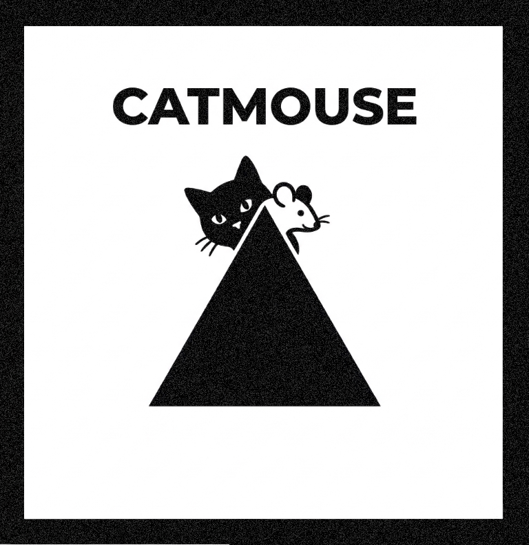

<p align="right">
  <a href="https://buymeacoffee.com/optoutbrussels">
    
  </a>
</p>


## Ethical License (CNPL v4)
CATMOUSE is released under the **Cooperative Non-Violent Public License**. 

This means you are free to use it for art, education, and civilian research. However:
- **NO Military Use:** Use by military organizations or for weapons development is strictly prohibited.
- **NO Surveillance:** Use for state-sponsored surveillance is prohibited.
- **Cooperative Only:** Commercial use is reserved for worker-owned cooperatives.


<picture>
  <source media="(prefers-color-scheme: dark)" srcset="images/LOGO_DARK.png">
  <source media="(prefers-color-scheme: light)" srcset="images/LOGO_LIGHT.png">
  
</picture>

# CATMOUSE by OPT-OUT
**Resilient Asymmetric Channel Hopping Protocol**

A highly experimental, asymmetric wireless game of hide-and-seek leveraging the physical Wi-Fi radio spectrum. The Mouse device autonomously hops and hides across physical Wi-Fi channels for dynamic intervals, while the Cat device rapidly fires targeted payload-strikes across the spectrum to locate it. It acts as a resilient, zero-configuration communication strategy for the ESP32 ecosystem.

### Core Architecture
* **Game IDs:** Isolate multiple pairs of devices in the same physical space by defining a unique `gameID`. Mice will completely ignore Cats hunting on a different ID, and vice-versa.
* **Auto-Discovery (The Squeak):** Forget hardcoding MAC addresses. The Mouse occasionally broadcasts a public Squeak containing its Game ID. A Cat boots up in `LISTENING` mode and actively scans all 13 channels until it catches a Squeak, autonomously locks onto the Mouse's MAC, and the hunt begins immediately.
* **Dynamic Stamina & Frenzy:** The Cat's sweep rate slows down the longer it misses (saving power and minimizing airwave congestion). When a Cat scores a Hit, it enters a 5ms interval "Frenzy," launching hyper-aggressive strikes before the Mouse can flee.
* **Universal IDF Compatibility:** Uses ESP-IDF version macros to maintain full compatibility across ESP-IDF v4 and v5+, safely manipulating the Physical Layer (PHY) across the ESP32, S3, C3, and C6 without crashing native hardware controllers.

---

## Quick Start Implementation

**ESP32 Hardware Compatibility:**
- **100% Variant Agnostic:** Uses low-level ESP-IDF `soc` macro checks to safely lock and manipulate the Physical Layer (PHY) across the ESP32, ESP32-S2, ESP32-S3, ESP32-C3, and ESP32-C6 without crashing native hardware controllers.

### 1. The Cat Device (Hunter)
This firmware defines the Hunter. It continuously sweeps the spectrum until it receives an ACK that the Mouse was hit.

```cpp
#include <CatMouse.h>

CatMouse cat;

// Define your Game ID. Cats will only hunt Mice with matching IDs.
const uint8_t gameID = 42;

void onCatHit(uint8_t channel) {
  Serial.printf("HIT! Found Mouse on Channel: %d | Hits Scored: %d\n", channel,
                cat.getHitsScored());
}

void onCatMiss(uint8_t channel) {
  Serial.printf("Miss... Sweeping Channel: %d | Sweeps: %d\n", channel,
                cat.getSweepsMissed());
}

void setup() {
  Serial.begin(115200);

  // Initialize as CAT using just the Game ID (no MAC address)
  // The Cat will boot in LISTENING mode, scanning channels until it hears a Squeak
  if (!cat.beginAsCat(gameID, nullptr, 10)) {
    Serial.println("Failed to initialize Cat! Check ESP-NOW.");
    while (true) delay(1000);
  }

  // Register the result callbacks
  cat.onHit(onCatHit);
  cat.onMiss(onCatMiss);

  Serial.println("Cat is scanning channels, listening for the first Mouse squeak...");
}

void loop() {
  // Calling update() triggers listening, and eventually sweeps & stamina logic
  cat.update();
}
```

### 2. The Mouse Device (Hider)
This firmware defines the Target. It silently sits on a channel for a random duration, occasionally Squeaks its ID, and instantly hops to a new channel the moment it gets hit.

```cpp
#include <CatMouse.h>

CatMouse mouse;

// Define your Game ID. The Mouse will only respond to Cats with this ID.
const uint8_t gameID = 42;

// Runs when the Cat finds the Mouse on the current channel
void onMouseCaught(uint8_t channel) {
  Serial.printf("CAUGHT! The Cat found me on Channel: %d ! Fleeing...\n",
                channel);
}

void setup() {
  Serial.begin(115200);

  // Initialize as MOUSE with the Game ID.
  // It will hide on a random channel for anywhere between 100ms and 500ms
  // Squeaks every 2000ms (default) to let Cats discover it
  if (!mouse.beginAsMouse(gameID, 100, 500)) {
    Serial.println("Failed to initialize Mouse! Check ESP-NOW.");
    while (true) delay(1000);
  }

  // Register the callback for when the Cat scores a direct hit
  mouse.onHit(onMouseCaught);

  Serial.println("Mouse is hiding and occasionally squeaking...");
}

void loop() {
  // Calling update() automatically triggers hops and periodic Squeak broadcasts
  mouse.update();
}
```

---

### Full Documentation
For full architectural explanations, API references, and conceptual guides, please download the library and open the included **`docs/index.html`** file in your browser.
OR JUST GO TO <a href="https://0p7-0u7.github.io/CATMOUSE/" target="_blank">CATMOUSE PAGE</a>
